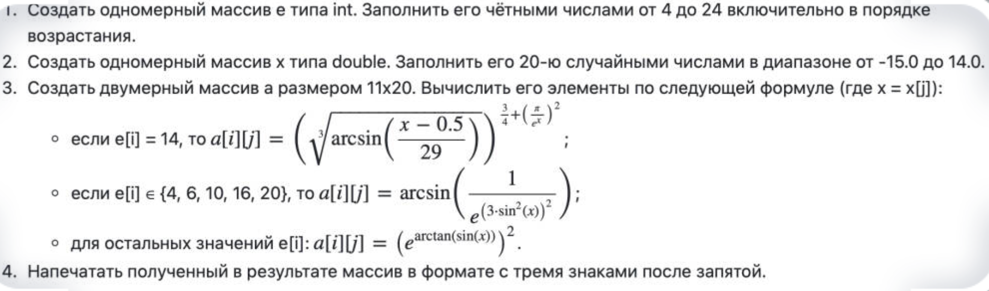
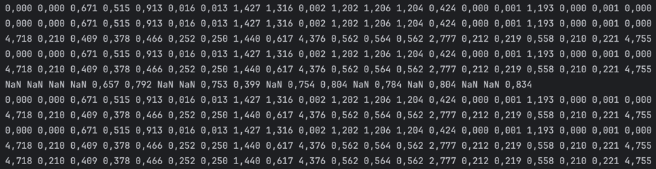

# Лабораторная работа #1

### Вариант `#368409` 

---
#### Задание

### Написать программу на языке Java, выполняющую соответствующие варианту действия. Программа должна соответствовать следующим требованиям:
- Она должна быть упакована в исполняемый jar-архив.
- Выражение должно вычисляться в соответствии с правилами вычисления математических выражений (должен соблюдаться порядок выполнения действий и т.д.).
- Программа должна использовать математические функции из стандартной библиотеки Java.
- Результат вычисления выражения должен быть выведен в стандартный поток вывода в заданном формате.

### Результат работы программы

## Вопросы к защите лабораторной работы:

- Язык `Java`. Особенности языка.
- Средства разработки. `JDK` и `JRE`.
- Примитивные типы данных в `Java`. 
- Работа с переменными. Декларация. Инициализация. Присваивание.
- Инструкции ветвления и циклов.
- Операторы и выражения в `Java`. Особенности вычисления, приоритеты операций.
- Математические функции в составе стандартной библиотеки Java. `Класс java.lang.Math`.
- Форматированный вывод числовых данных.

